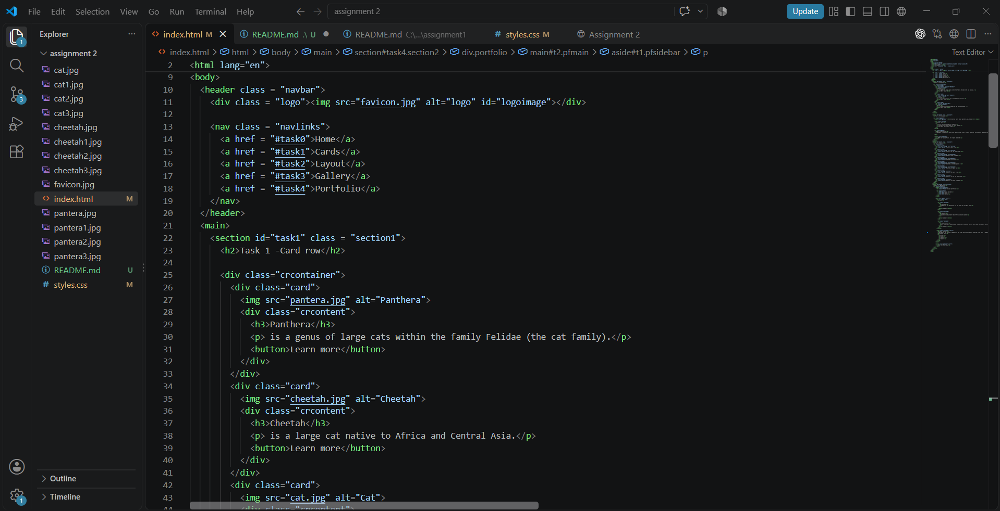
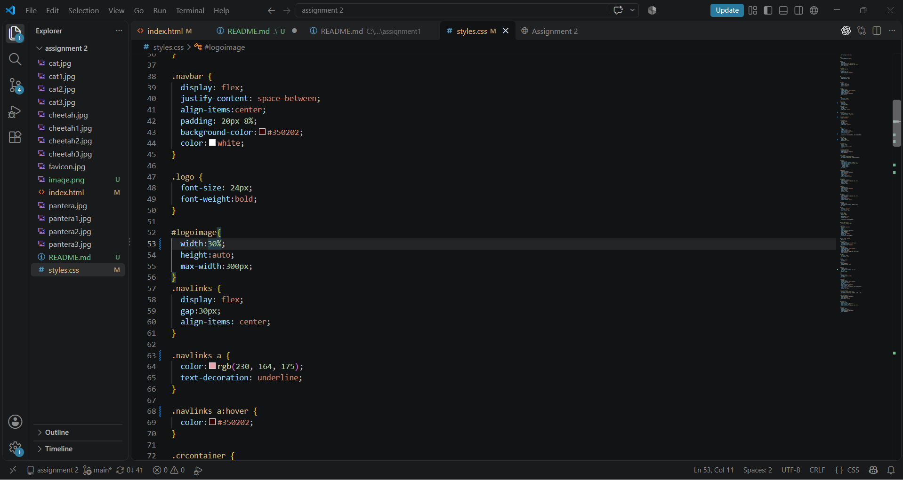
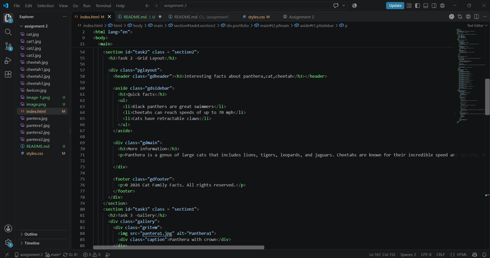
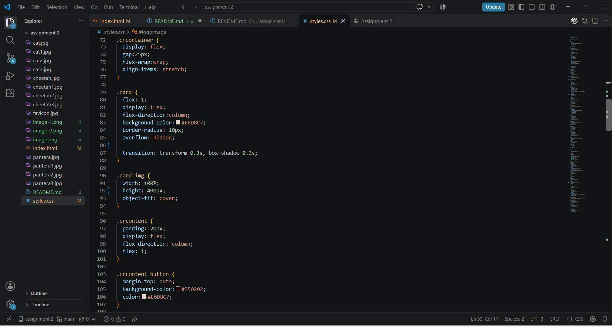
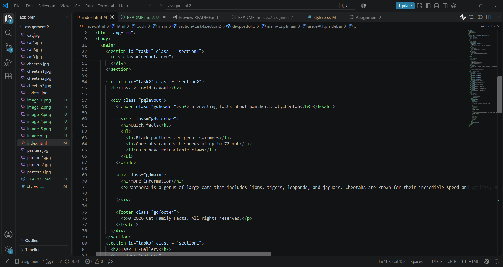
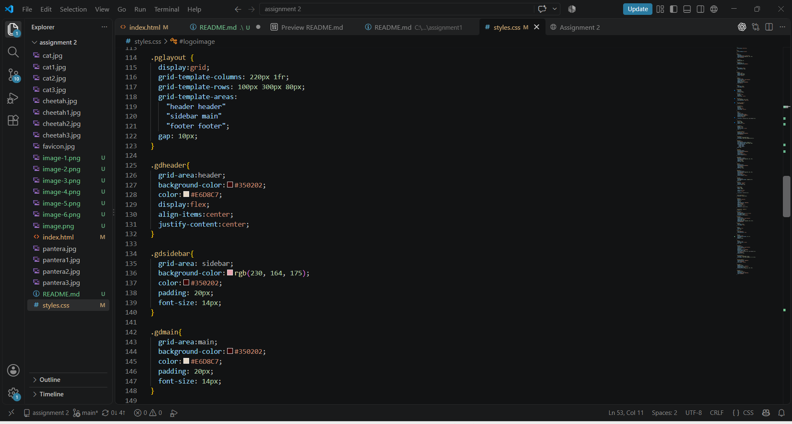
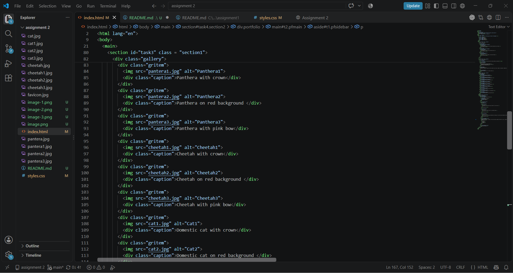
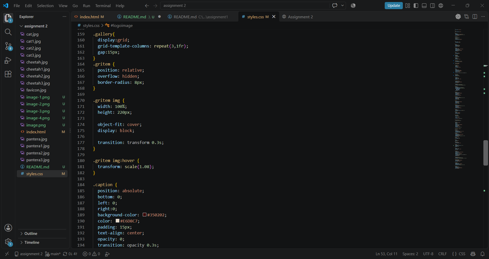
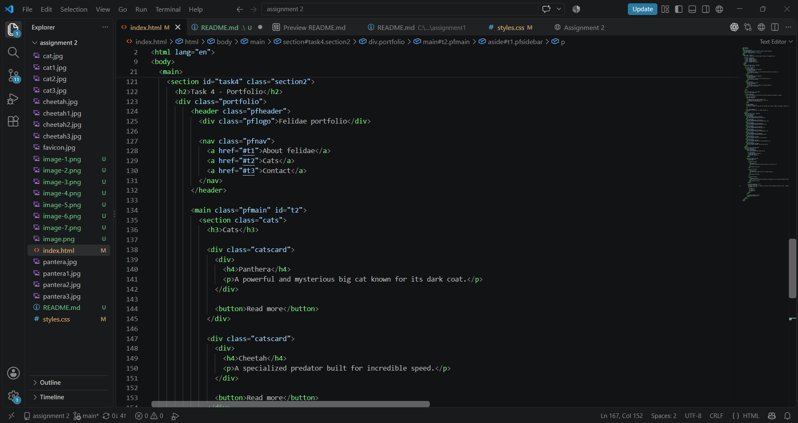
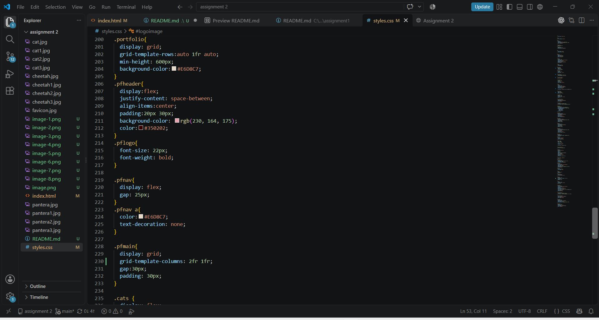

# Advanced CSS Assignment

**Name:** Akerke Berdakul  
**Group:** IT-2503

---
## Part 1 : Flexbox
### Task 0. Navigation Bar

1.	Create a header section with a logo on the left and a list of links on the right.
2.	Turn the header container into a flex container.
3.	Align the logo and the links horizontally.
4.	Apply spacing between the links using Flexbox properties.
5.	Make sure the logo and links are vertically centered.

### Task 1. Card Row

1.	Create a container with at least three cards (each card should include an image, title, text, and button).
2.	Make the container a flex container so the cards appear in a row.
3.	Ensure all cards have equal height.
4.	Add consistent gaps between the cards.
5.	Add a simple hover effect (e.g., shadow, lift, or scale).

## Part 2 : Grid system

### Task 2 : Page Layout with Grid Areas

1.	Set up a layout with a header, sidebar, main content, and footer.
2.	Turn the parent container into a grid container.
3.	Define grid rows and columns.
4.	Assign grid areas so that:
o	The header spans across the top,
o	The sidebar is placed on the left,
o	The main content is on the right,
o	The footer spans across the bottom.
5.	Confirm that each section fits correctly into its grid area.

### Task 3 : Image gallery

1.	Collect at least nine images and place them inside a gallery container.
2.	Set the gallery container as a grid container.
3.	Define multiple equal-width columns and rows.
4.	Add consistent spacing (gaps) between images.
5.	Add a hover effect — for example, display a caption overlay when the user hovers over an image.

## Part 4 : Combining Flexbox & Grid

### Task 4 : Portfolio page

1.	Create a page structure with: header, main section, sidebar, and footer.
2.	Use Flexbox in the header for the navigation bar.
3.	Use CSS Grid for the main section:
o	Projects area on the left,
o	Info or sidebar on the right.
4.	Inside each project card, use Flexbox to arrange content (title, description, button).
5.	Ensure the footer spans across the bottom of the page.
6.	Review the page for consistency in spacing and alignment.

----
## Work Process Summary

First, I created the basic HTML structure for the Wild Cats website. Then, I used Flexbox to create the navigation bar and arrange the animal cards in a row. After that, I used CSS Grid to create the page layout and the nine-image gallery. I added hover effects to the cards and gallery images to make the website more interactive. Finally, I combined Flexbox and Grid to create the final Wild Cats information page and checked the spacing, alignment, and overall structure of the website.

